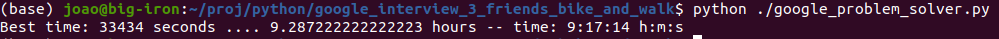

# Google Interview Puzzle 3 friends and 1 bike.
One more problem solved by Monte Carlo simulation.

## Description
This was a google interview question that is explained in the following link:  

* Google Interview Riddle - 3 Friends Bike and Walk  
[https://www.youtube.com/watch?v=82b0G38J35k](https://www.youtube.com/watch?v=82b0G38J35k)  

Basically, you have 3 friends that want to go from one house A to a house B, the distance between them is 300 KM, They have one bike that can take maximum of2 of the friends at a time, and need a pilot.

* When a person is walking it goes at 15 KM/h.
* When a person is on the bike they go at 60 KM/h.
* What's the lowest time it takes them to go from house A to house B?

The result is in the video and is 9.28 Hours, or 9H:17M.
This problem is not very difficult to analyze analytically, but it exemplifies how a person that can program can transform a analytical problem, that could be even more complex, by encoding it's rules in a program to make a simulation of the problem. And by using the power/speed of the computer to make a Monte Carlo simulation and determining the solution to the problem.  
Although in this case is not a very difficult problem.  
 
I have used a similar strategy for my solution to the Monty Hall Problem  
 

* The Monty Hall Problem In JAVA  
[https://github.com/joaocarvalhoopen/The_Monty_Hall_Problem_In_JAVA](https://github.com/joaocarvalhoopen/The_Monty_Hall_Problem_In_JAVA)  

In a professional setting, once I was once in a course on the first days of job and the "Big Boss" enters the room with all of us. He looks to see how we were all doing, and he puts a difficult mathematical problem challenge in the white board, (I don't remember the details of the challenge).  
We were all newbies trying to impress and when we went home we all tried to do the challenge, I was at the problem for several hours and couldn't figure it out.  
But it was a contained problem that couldn't be easily brute force broken by hand, but I figured that if I implemented it on a computer I could simulate it with all outcomes or if that didn't work i could try to optimize it by the Monte Carlo Method.  
That night, I programmed it in Java and the next day I was the only one with a solution to the problem. Not because I was smarter then the others, but because I knew a nice way to use the tools that I had at my disposal, the computer.  
 
The reason that I have made this Repository and the Monty Hall Problem in Java, is to show others this cool way of solving complex problems.  
By Brute Forcing it with exhaustive searching, or by Monte Carlo simulation.  
In either way, put the computer to do the heavy lifting, and use the fact that you know how to program.         

## References
* Google Interview Riddle - 3 Friends Bike and Walk  
  [https://www.youtube.com/watch?v=82b0G38J35k](https://www.youtube.com/watch?v=82b0G38J35k)

* The Monty Hall Problem In JAVA  
  [https://github.com/joaocarvalhoopen/The_Monty_Hall_Problem_In_JAVA](https://github.com/joaocarvalhoopen/The_Monty_Hall_Problem_In_JAVA)

## License
MIT Open Source license.

## Have fun
Best regards,  
Joao Nuno Carvalho  

